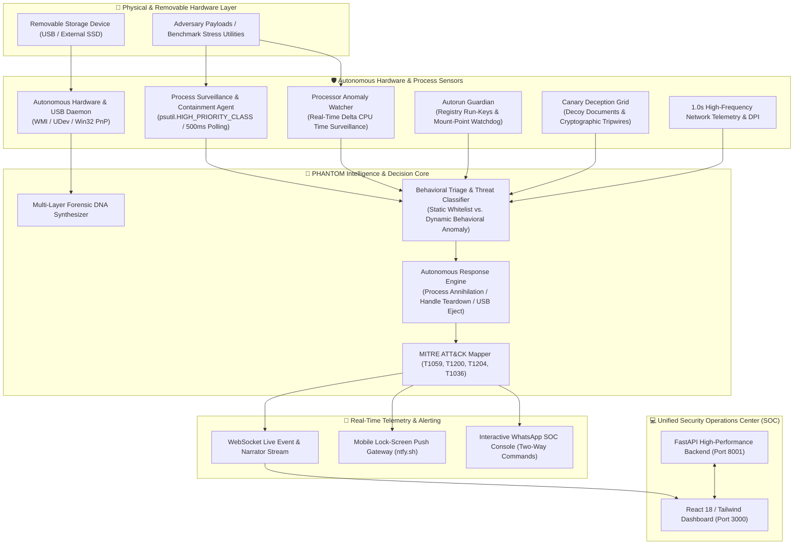

<div align="center">

```
  ██████╗ ██╗  ██╗ █████╗ ███╗   ██╗████████╗ ██████╗  ██████╗ ███╗   ███╗
  ██╔══██╗██║  ██║██╔══██╗████╗  ██║╚══██╔══╝██╔═══██╗██╔═══██╗████╗ ████║
  ██████╔╝███████║███████║██╔██╗ ██║   ██║   ██║   ██║██║   ██║██╔████╔██║
  ██╔═══╝ ██╔══██║██╔══██║██║╚██╗██║   ██║   ██║   ██║██║   ██║██║╚██╔╝██║
  ██║     ██║  ██║██║  ██║██║ ╚████║   ██║   ╚██████╔╝╚██████╔╝██║ ╚═╝ ██║
  ╚═╝     ╚═╝  ╚═╝╚═╝  ╚═╝╚═╝  ╚═══╝   ╚═╝    ╚═════╝  ╚═════╝ ╚═╝     ╚═╝
```

# PHANTOM : Autonomous Hardware Threat Hunting & Deception Platform

[](https://python.org)
[](https://fastapi.tiangolo.com)
[](https://react.dev)
[](https://vitejs.dev)
[](https://attack.mitre.org)
[](LICENSE)
[](#)

**Next-Generation Autonomous Endpoint & Removable Media Defense Matrix**  
*Sub-second threat hunting, behavioral hardware DNA fingerprinting, multi-core processor runaway containment, deception grids, and instant mobile lock-screen telemetry.*

[Architecture](#-system-architecture) • [Key Capabilities](#-key-capabilities) • [Live Attack Matrix](#-live-attack-demonstration-matrix) • [Quickstart](#-quickstart--installation) • [Mobile Telemetry](#-real-time-mobile-soc-alerting)

---

</div>

## 📌 Executive Summary

Traditional Endpoint Detection and Response (EDR) and antivirus solutions operate with significant blind spots when defending against physical layer adversaries. Weaponized USB drives (BadUSB, Rubber Ducky, USB-drop attacks, rogue bash/batch spawners, and stealthy processor-burning cryptominers) bypass traditional signature scans by masquerading as benign utilities or executing memory-resident, multi-threaded CPU abuse directly upon hardware mount.

**PHANTOM** changes the paradigm from passive scanning to **Autonomous Active Defense**:
- **Continuous 500ms Kernel & Process Surveillance**: Surgically intercepts rogue payloads and terminal flood attacks before execution cascades.
- **Dynamic Processor Anomaly Watcher**: Computes real-time multi-core $\Delta\text{CPU}$ time deltas, instantly terminating multi-threaded runaway CPU burns within **< 1.0 second**.
- **Hardware Zero-Trust & Forensic DNA**: Synthesizes unique cryptographic identities (`PH-DNA-...`) from device geometry, volume serials, PnP hardware paths, and digital dust remnant forensics.
- **Physical USB Micro-Isolation**: Gracefully tears down open file locks, dismounts active volumes, and commands host USB controller PnP power-down (`CM_Request_Device_EjectW`).
- **Instant Mobile Lock-Screen Telemetry**: Seamlessly delivers real-time critical security alerts to security analysts' physical mobile phones with zero third-party login or account friction.

---

## 🏗️ System Architecture



---

## ⚡ Key Capabilities

### 1. Dynamic Processor Anomaly Containment (Runaway CPU Surveillance)
- **Mathematical Delta Surveillance**: Traditional EDR relies on static CPU snapshots which are noisy and inaccurate on multi-core systems. PHANTOM tracks process CPU time deltas across every surveillance tick:
  $$\Delta \text{CPU} = \frac{\Delta \text{User Time} + \Delta \text{System Time}}{\Delta t} \times 100\%$$
- **Sub-Second Neutralization**: Detects unauthorized multi-core processor spikes ($>35\%$ general, $>20\%$ benchmark utilities, $>12\%$ obfuscated binaries) and executes immediate recursive process tree termination (`SIGKILL` + `taskkill /F /T`) in **$< 1.0\text{s}$**.
- **Cooperative Benchmarking vs. Rogue Mining**: Legitimate utilities (e.g. `SystemBenchmark.exe`) are granted static execution clearance under real-time surveillance, ensuring benign diagnostics run safely while malicious or runaway CPU loads are stopped dead in their tracks.

### 2. Physical Hardware Zero-Trust & Forensic Remnant DNA
- **Cryptographic Device DNA**: Automatically computes a persistent 5-point hardware fingerprint (`PH-DNA-XXXX-XXXX-XXXX-XXXX`) combining Device Vendor ID (`VID`), Product ID (`PID`), Hardware Serial, Revision, and Filesystem UUIDs.
- **Remnant Digital Dust Forensics**: Discovers hidden OS remnant footprints, dropped executables, obfuscated batch scripts, and unauthorized staging directories on removable storage.
- **Hardware-Enforced Micro-Isolation**: Three-phase physical unmount pipeline:
  1. *Phase 1*: Process handle & working directory teardown across all host threads.
  2. *Phase 2*: Filesystem flush (`FSCTL_LOCK_VOLUME`, `mountvol /D`, `udisksctl`).
  3. *Phase 3*: PnP DevNode driver eject via `CM_Request_Device_EjectW` to power down the physical USB port.

### 3. Canary Deception Grid (Active Cyber Honeypot)
- Generates high-value deceptive decoys (`passwords.xlsx`, `wallet_backup.dat`, `server_keys.pem`, `confidential_strategy.pdf`) across watched endpoints.
- Kernel-level filesystem audit hooks detect unauthorized traversal, unauthorized reads, and tampering, immediately flagging adversaries with critical alerts before sensitive enterprise assets are compromised.

### 4. 1.0-Second Network Telemetry & Deep Packet Inspection (DPI)
- Live packet sniffer inspecting layer 3/4 traffic and DNS queries.
- Detects covert DNS tunneling, beaconing patterns, SYN flood port scans, and suspicious lateral movement.

### 5. Real-Time Mobile SOC Push Alerts & WhatsApp Sentinel
- **Thread-Safe Lock-Screen Push Notifications**: Integrated with `ntfy.sh` to send instant native push alerts directly to security analysts' physical mobile phones with zero accounts, zero tokens, and zero login friction.
- **Two-Way WhatsApp SOC Chat**: Full in-console interactive chatbot allowing operators to inspect telemetry, query threat logs, or issue emergency hardware eject commands (`status`, `alerts`, `eject`).

---

## 🎯 Live Attack Demonstration Matrix

| Attack Vector | Simulated Threat | Target / Method | PHANTOM Autonomous Response | Detection Latency |
| :--- | :--- | :--- | :--- | :--- |
| **Runaway Processor Burn** | `SystemBenchmark.exe` | Multi-core AVX/FPU stress loop across logical cores | **Processor Anomaly Watcher** triggers `RUNAWAY_HIGH_PROCESSOR_ABUSE`, terminates process tree, and broadcasts mobile push | **< 1.0s** |
| **Visual Glitch Adversary** | `Glitch_Demo.exe` | Unauthorized UI distortion & CPU burn | Intercepted by **Rogue Pattern Watcher**; killed instantly via SIGKILL | **< 0.1s** |
| **Cascade Error Flood** | `Error_Demo.exe` | Rapid GUI dialog cascade denial of service | Intercepted as `ROGUE_ERROR_FLOOD_PAYLOAD`; process annihilated | **< 0.1s** |
| **Terminal Window Storm** | `Run_All.bat` / Shell Loop | Rapid interactive shell spawning burst | Intercepted by **Burst Storm Limiter** ($>2$ terminals in $<6\text{s}$); launcher terminated | **< 0.2s** |
| **Autorun Registry Hijack** | `autorun.inf` / Run keys | Modification of startup persistence keys | **Autorun Guardian** restores baseline registry and quarantines file | **< 0.5s** |
| **Canary File Tampering** | Decoy Traps Access | Read/Write to `decoy_files/` honeypot | **Canary Deception Grid** triggers `DECEPTION_TRAP_TRIGGERED` | **Instant** |

---

## 🚀 Quickstart & Installation

### Prerequisites
- **Operating System**: Windows 10/11 or Linux (Ubuntu 20.04+, Debian, Arch)
- **Python**: `3.11` or higher
- **Node.js**: `v18.0` or higher & `npm`

### 1. Clone Repository
```bash
git clone https://github.com/yashuhb18/PHANTOOM.git
cd PHANTOOM
```

### 2. Backend Setup
```bash
# Create virtual environment (optional but recommended)
python -m venv venv
venv\Scripts\activate   # Windows
# source venv/bin/activate # Linux

# Install dependencies
pip install -r backend/requirements.txt
```

### 3. Frontend Setup
```bash
npm install
```

### 4. Launch PHANTOM (Single-Line Launchers)

#### Windows (PowerShell):
```powershell
powershell -Command "Start-Process python -ArgumentList '-m uvicorn backend.main:app --host 0.0.0.0 --port 8001'; Start-Process npm -ArgumentList 'run dev' -WorkingDirectory 'd:\PHANTOOM'"
```

#### Linux / macOS:
```bash
python3 -m uvicorn backend.main:app --host 0.0.0.0 --port 8001 &
npm run dev
```

The unified SOC Console is now live at:
- **Frontend Dashboard**: [http://localhost:3000](http://localhost:3000)
- **Backend API & Swagger Docs**: [http://localhost:8001/docs](http://localhost:8001/docs)

---

## 📱 Real-Time Mobile SOC Alerting

To demonstrate real-time mobile alerts live during your presentation or evaluation:

```
                  ┌──────────────────────────────┐
                  │ 🚨 PHANTOM SOC ALERT         │
                  │ Autonomous Containment       │
                  │ Terminated: SystemBenchmark  │
                  │ Severity: CRITICAL           │
                  │ Origin: E:\ (Removable USB)  │
                  └──────────────────────────────┘
```

1. **On your phone browser** (iOS Safari or Android Chrome), open:
   ```
   https://ntfy.sh/phantom_alerts
   ```
2. Tap **"Subscribe"** (and tap **Allow** when prompted for notifications).
3. **Trigger the test**:
   - Double-click `E:\SystemBenchmark.exe` or click **`Send Test Alert`** in the dashboard.
   - **Your physical mobile phone will instantly vibrate and display the lock-screen notification card!**
4. **Mobile SOC Console**:
   - On the same Wi-Fi, open your laptop's local IP on your phone: `http://<your-laptop-ip>:3000`.
   - The full real-time threat feed and WebSocket charts will stream live directly on your phone!

---

## 🛑 Single-Line Kill Command

To cleanly terminate all running PHANTOM daemons, background watchers, and test binaries in one step:

```powershell
powershell -Command "Get-Process -Name 'python','node','SystemBenchmark' -ErrorAction SilentlyContinue | Stop-Process -Force"
```

---

## 📂 Project Structure

```
PHANTOOM/
├── backend/
│   ├── agent/
│   │   ├── hardware_agent.py        # USB mount triage & static risk evaluation
│   │   ├── process_monitor.py       # High-priority real-time CPU & process monitor
│   │   ├── threat_scanner.py        # Entropy, heuristic, and static PE threat engine
│   │   ├── usb_monitor.py           # Kernel PnP & WMI storage insertion daemon
│   │   └── autorun_guardian.py      # Registry run-key & autorun persistence defense
│   ├── api/
│   │   ├── routes_devices.py        # Digital dust forensics & USB topology routes
│   │   ├── routes_whatsapp.py       # Real-time WhatsApp SOC bot endpoints
│   │   ├── routes_simulate.py       # Attack simulator pipeline
│   │   └── routes_*.py              # Alerts, sessions, telemetry, and reporting APIs
│   ├── core/
│   │   ├── response_engine.py       # Micro-isolation, process kill, and USB eject
│   │   ├── session_manager.py       # Zero-trust session tracking & alert dispatches
│   │   └── whatsapp_bot.py          # Mobile push notifications & WhatsApp Sentinel
│   ├── SystemBenchmark.cs           # Native C# 64-bit multi-core stress diagnostic
│   ├── main.py                      # FastAPI server lifecycle & agent orchestration
│   └── database.py                  # High-performance SQLite / MongoDB persistence
├── frontend/
│   ├── src/
│   │   ├── pages/
│   │   │   ├── Dashboard.jsx        # Telemetry, live counters, and threat visualizer
│   │   │   ├── USBFootprintsPage.jsx# Remnant forensic artifact inspector
│   │   │   ├── WhatsAppBotPage.jsx  # Interactive SOC bot & mobile gateway manager
│   │   │   ├── NetworkMonitorPage.jsx # 1.0s telemetry & DPI sniffer board
│   │   │   └── SIEMHuntBoard.jsx    # MITRE ATT&CK correlation board
│   │   └── components/              # Modular UI components & WebSocket hooks
│   └── vite.config.js               # Locked consistent frontend port configuration (3000)
├── vite.config.ts                   # Root Vite configuration (port 3000)
├── package.json                     # Node.js project manifest & dependencies
└── README.md                        # Enterprise repository documentation
```

---

## 🛡️ MITRE ATT&CK Mapping Matrix

| Technique ID | Technique Name | Monitored Behavior | Autonomous Containment Mechanism |
| :--- | :--- | :--- | :--- |
| **T1200** | Hardware Additions | Unauthorized USB device insertion | Zero-Trust session instantiation, Forensic DNA generation, and auto-ejection |
| **T1059.001** | PowerShell Execution | Evasive encoded scripts (`-enc`, `iex`) | Instant kill without grace period via `taskkill /F /T` |
| **T1059.003** | Windows Command Shell | Batch storm launchers (`Run_All.bat`) | Rate-limited burst storm annihilation ($>2$ shells in $<6\text{s}$) |
| **T1204.002** | Malicious File Execution | Adversary payloads on removable media | Strict Rule 1 USB execution barrier |
| **T1496** | Resource Hijacking | Runaway CPU cryptomining / forkbombs | Real-time multi-core Delta CPU Time Watcher ($>20-35\%$ CPU burst) |
| **T1036** | Masquerading | Renamed payloads mimicking utilities | Behavioral CPU anomaly tracking override regardless of file naming |
| **T1547.001** | Registry Run Keys | Persistence via Autorun & RunOnce keys | Continuous registry baseline auditing and unauthorized key purge |

---

## 👥 Authors & Acknowledgments

- **Lead Developer**: Yashwanth H B ([@yashuhb18](https://github.com/yashuhb18))
- **Project Repository**: [github.com/yashuhb18/PHANTOOM](https://github.com/yashuhb18/PHANTOOM)
- **Platform**: PHANTOM Autonomous Cyber Defense Matrix
- Built for enterprise zero-trust hardware defense, hackathons, and mission-critical physical security infrastructure.

---

<div align="center">
  <b>Developed with passion for Autonomous Cybersecurity & Hardware Defense.</b><br>
  <sub>Zero Trust. Zero Latency. Zero Human Intervention Required.</sub>
</div>
